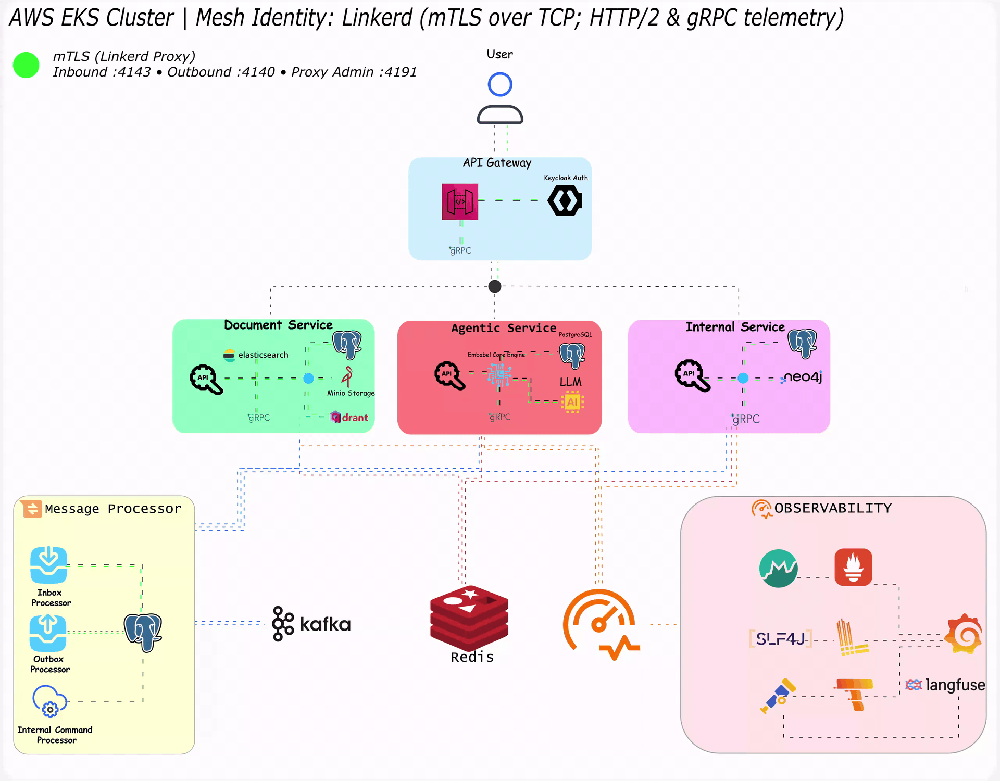

# Sparrow-X

## 🔁 Runtime Traffic Flow

*Animated service-to-service data flow inside the Sparrowx mesh.*

SparrowX is an internal knowledge and agentic search system for engineering organizations. 
It connects company documents, service ownership, onboarding workflows, runbooks, 
repositories and internal domain data into one searchable, explainable assistant.

The goal is to make SparrowX behave like an internal engineering brain: A system that can
answer questions, find context, guide new engineers and reason across structured and 
unstructured company data.

>Crucially, this brain is completely self-referential. Upon deployment, 
SparrowX indexes Agentic-Service's own codebase and system architecture into onboarding paths.  
Incoming developers use the platform itself to learn exactly how to build, scale, 
and navigate an agentic orchestration system.

## Core Services

SparrowX is built around three core services:

* **agenticsvc** - The orchestration layer that receives user missions, parses intent, plans tool calls, invokes internal services, coordinates agent execution, and produces grounded answers.

* **intsvc** - The structured internal system that stores teams, engineers, services, onboarding paths, tasks, ownership, service metadata, and internal business/domain entities.

* **docsvc** - The document intelligence layer that handles document upload, extraction, chunking, hybrid retrieval, vector search, keyword search, citation verification, and evidence graph construction.

* **bb** - The shared building-blocks foundation. It provides reusable infrastructure used 
across SparrowX services, including command/query handling, validation, observability,
tracing, metrics, exception handling, context propagation, resilience patterns, and 
common domain primitives. Non-executable library that keeps `agenticsvc`, `intsvc`, and `docsvc` consistent.

## What SparrowX Can Do

### 1. Engineering Knowledge Discovery

**Example multi-hop query:**

> “For the Agentic Orchestrator service, find the latest architecture documents, 
> identify the owning teams and primary engineers, list the related repositories, 
> summarize recent pull-requests or deployments affecting it, and tell me which runbooks 
> should be used if latency increases during agent execution.”

**Expected SparrowX execution:**

* **`intsvc`** resolves the target services, owning teams, associated engineers, and core service metadata.
* **`docsvc`** searches the vector index for technical documents, repository READMEs, and relevant runbooks.
* **`agenticsvc`** correlates teams ownership, repository context, recent pull_requests, active deployments, and runbooks evidence into a single, fully cited response.

### 2. Company Intranet / Internal Search

**Example multi-hop query:**

> “Find the current documents for production deployments, then compare them against the Agentic Orchestrator service documents and runbooks to tell me whether the service follows the approved deployment processes.”

**Expected SparrowX execution:**

* **`docsvc`** retrieves global deployment standards, engineering documents, and service-specific runbooks.
* **`intsvc`** identifies the specific services, code repositories, and structural metadata.
* **`agenticsvc`** evaluates the deployment process requirements against the service's historical deployments and active documents to return gaps, evidence, and compliance updates.

### 3. Onboarding

**Example multi-hop query:**

> “For a new backend engineer joining the Agentic Service Team, build onboarding-paths 
> using the team’s services, required repositories, architecture documents, 
> access-requests, permissions, runbooks, and open onboarding-tasks.”

**Expected SparrowX execution:**

* **`intsvc`** fetches the target engineers metadata, teams composition, active onboarding_paths, pending onboarding_tasks, and service dependencies.
* **`docsvc`** extracts getting-started documents, service architecture layouts, and operational runbooks.
* **`agenticsvc`** builds a sequenced onboarding path flagging required access_requests, missing permissions, mandatory reading documents, and the next actionable onboarding_tasks.

### 4. Research / Analysis Over Internal Data

**Example multi-hop query:**

> “Analyze whether the Agentic Orchestrator service has operational risks by correlating recent pull_requests, failed deployments, teams modifications, architecture documents, runbooks completeness, and any documents mentioning recurring model timeouts.”

**Expected SparrowX execution:**

* **`intsvc`** gathers historical services metrics, teams changes, recent pull_requests activity, and deployment logs.
* **`docsvc`** indexes architecture documents, internal runbooks, post-mortem documents, and files referencing runtime timeouts.
* **`agenticsvc`** synthesizes the cross-service evidence into an objective risk profile, maps code changes from pull_requests to failed deployments, and references the exact source documents.

---

## 📊 Enterprise Simulation & LLMOps (Langfuse Integration)

Out of the box, SparrowX comes preloaded with a **production-grade seed data pipeline** designed to mimic a real, operating enterprise. The environment spins up a native **Agentic Service Team** alongside several other engineering teams acting as isolated organizational tenants.

This multi-tenant simulation generates active synthetic workloads, allowing you to view and analyze live LLMOps metrics via a built-in **Langfuse** dashboard. For organizations running autonomous agents at scale, this integration demonstrates how Langfuse enables you to:

* **Visualize Nested Agent Traces:** Inspect complex, multi-turn agent reasoning paths. You can track exactly how a parent orchestration span branches into specific document lookups, tool calls, or downstream LLM generations.
* **Monitor Multi-Tenant Cost & Latency:** Break down token consumption, financial costs, and latency profiles dynamically across different engineering teams, service domains, and model types.
* **Manage Prompts & Iteration Loops:** View how system prompts are centrally versioned, tested in the LLM playground, and hot-deployed to specific agent pipelines without code changes.
* **Track Operational Quality (Evals):** Monitor live performance using automated "LLM-as-a-judge" scoring metrics, capturing hallucination benchmarks and execution accuracy trends over time.
This exposes Sparrowx as an agentic internal knowledge system that combines retrieval, structured company context, evidence verification, and workflow orchestration into one engineering assistant.

## Roadmap

| Feature          | Dormant | In Progress | Completed |
|------------------|---------|-------------|-----------|
| API Gateway      |   ✅     |             |           |
| Agentic Service  |        |      ✅       |           |
| Building Blocks  |         |            |     ✅       |
| Document Service |        |             |       ✅    |
| Internal Service |        |             |      ✅     |

