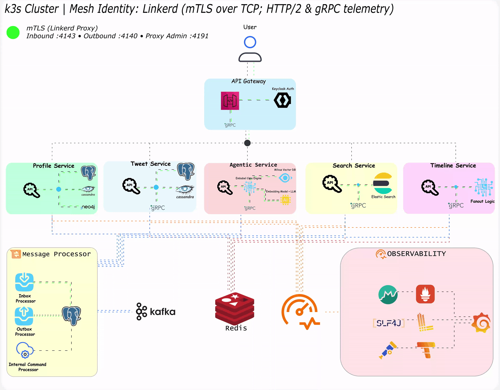

# Sparrow-X

## 🔁 Sparrowx Runtime Traffic Flow

*Animated service-to-service data flow inside the Sparrowx mesh.*

A distributed-systems playground where the flagship feature is Agentic RAG: Which ingests realistic social-network signals—profiles, follows, replies, reposts, likes, bookmarks, search queries, and link-outs to long-form artifacts (PDFs in MinIO)—and turns them into goal-driven LLM workflows for queries, insights, and experiments.

The Twitter clone is intentionally “just the substrate,” inspired by Grok’s premise: at large scale, a stream of hundreds of millions of daily interactions can make a network feel like a second-generation directory of human knowledge. Sparrowx distills that same idea into an accessible MVP—useful for junior devs learning bottom-up (how each service and data flow works), and for senior engineers coming from other stacks learning top-down (how the platform behaves end-to-end).

Under the hood, Sparrowx is goal-oriented and OODA-looped. Every request is framed as a concrete objective (eg. “find high-signal researchers,” “verify claims against PDFs,” “summarize contradictions,” “recommend accounts to follow”). The system then runs an Observe → Orient → Decide → Act cycle: it observes live social signals and retrieved documents, orients by building context (embeddings + metadata + reputation/engagement features), decides on the next best action (retrieve, rerank, validate, call a tool, expand search, generate a report), and acts—executing those steps via an action registry/tooling layer until the goal is met or budgets/timeouts are reached.

## Goals Of This Project
- 🔹 Using Vertical Slice Architecture for architecture level.
- 🔹 Using Spring MVC as a Web Framework.
- 🔹 Using Domain Driven Design (DDD) to implement all business processes in microservices.
- 🔹 Using Spring Kafka  on top of Kafka for Event Driven Architecture between our microservices.
- 🔹 Using gRPC for internal communication between our microservices.
- 🔹 Using CQRS implementation with a Mediator library.
- 🔹 Using Agentic RAG powered by Embabel: The system decomposes a user goal into retrieval and reasoning actions, dynamically combining hyper-search over tweets, relationship-aware lookups, and vector-based semantic recall—all expressed through natural-language intent rather than fixed queries. i.e. Goal → Observe signals → Expand context → Validate evidence → Synthesize output
- 🔹 Using Spring Data JPA for data persistence and ORM in write side with Postgres.
- 🔹 Using Spring Data Cassandra for data persistence and ORM in read side with CassandraDB.
- 🔹 Using Spring Data Neo4j for graph-based queries, social graph traversal, and recommendation logic.
- 🔹 Using Inbox Pattern for ensuring message idempotency for receiver and Exactly once Delivery.
- 🔹 Using Outbox Pattern for ensuring no message is lost and there is at At Least One Delivery.
- 🔹 Using Unit Testing for testing small units and mocking our dependencies with Mockito.
- 🔹 Using End-To-End Testing and Integration Testing for testing features with all dependencies using testcontainers.
- 🔹 Using Spring Validator and a Validation Pipeline Behavior on top of Mediator.
- 🔹 Using Springdoc Openapi for generating OpenAPI documentation in Spring Boot.
- 🔹 Using OpenTelemetry Collector for collecting Metrics, Tracings, and Structured Logs.
- 🔹 Using Loki for Logging.
- 🔹 Using Tempo for Distributed Tracing.
- 🔹 Using Prometheus and Grafana for monitoring.
- 🔹 Using Keycloak for authentication and authorization based on OpenID-Connect and OAuth2.
- 🔹 Using Spring Cloud Gateway MVC as a Microservices' gateway.

## Roadmap

| Feature              | Dormant | In Progress | Completed |
|----------------------|---------|-------------|-----------|
| API Gateway          |        |             |      ✅     |
| Agentic Service          |    ✅    |             |           |
| Building Blocks      |         |            |     ✅       |
| Fanout Service         |    ✅     |             |           |
| Profile Service         |        |     ✅        |           |
| Storage Service         | ✅       |             |           |
| Search Service | ✅       |             |           |
| Timeline Service | ✅       |             |           |
| Tweet Service | ✅       |             |           |

